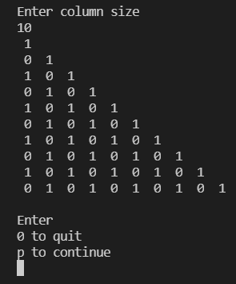
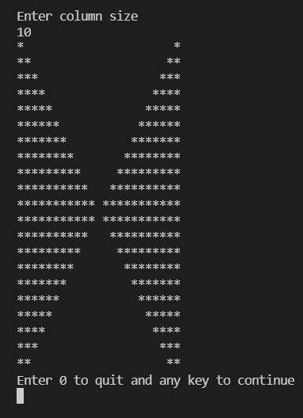

# Universal Star-Pattern-CPP

#Download and run main.cpp only

Different star pattern in C++

# Square

1. Rectangle / Square Pattern 

 
2. Hollow Rectangle
 

# Triangle

3. Inverted Half Triangle

4. Triangle

5. Number Triangle

6. Floyd's Triangle

7. Inverted Number Triangle
 

8. 1-0 Triangle

9. Number Pyramid

10. Palindrome Triangle

# Advanced Pattern

13. Zig Zag Pattern

14. Star Pattern

15. ButterFly

16. Rhombus

